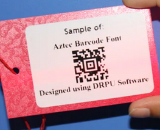
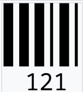

### Модель разметки

Размечаем коды четырехугольниками по часовой стрелке.
* Для одномерных кодов разметку начинаем с угла, движение от которого по часовой стрелке идёт *вдоль линии кода*, а не поперек.
* Для QR-кодов разметка начинается с опорного угла, который не смежен с неопорным углом.
* Для Data Matrix разметка начинается с того угла, где пересекаются опорные отрезки.

Цифры на одномерных кодах не важны и выделять их не нужно.
На *весёлых* дизайнерских кодах нужно выделять  основную область без лишних деталей.
* Однако дополнительно можно разметить контуры целиком для более аккуратного обучения.

Нужно ли размечать коды с перекрытиями?
* В нулевом приближении — нет, в первом — нужно, поскольку понятно, что за найденный заклеенный штрихкод штрафовать сетку нужно не так сильно, как за абстрактные линии на заборе.
Важный краевой случай: код вышел за край изображения.

Атрибуты, которые хотим сохранять для каждого кода (*на данном этапе*):
* тип кода (включая generic 1D и generic 2D);
* тег: не смысла декодировать (*напр. 1D-код вылез за край изображения*) / есть смысл попытаться (*напр. 2D-код вылез маленьким краешком*).

**Одна картинка — один файл разметки.**

### Метки разметки

Для каждого размеченного бар-кода нужно поставить метку обозначающую его тип, а также метку обозначающую сложность/невозможность декодирования.

#### Метки сложности декодирования

Данный тип меток ставится только в случае, если при декодировании могут потенциально могут возникнуть проблемы. Например: нет половины кода или его детали из-за качества не разобрать -> невозможно декодировать -> ставим **id**, не хвататет небольшой части кода или плохо разборчивый -> но можно попробовать декодировать -> **hd**.

- **hd** -- hard to decode, случай, когда еще можно попробовать декодировать
- **id** -- impossible to decode, случай, когда еще декодировать даже пытаться не надо

#### Метки типов кодов

Для каждого размеченного бар-кода должна ставиться метка с его типом, если же тип кода понять не получается, то нужно поставить метку двумерный это код (qr-code, aztec-code, pdf417 и тд.) или одномерный (штрих-коды).

- **1d** -- одномерный бар-код, но конкретный тип понять не удалось
- **2d** -- двумерный бар-код, но тип определить не удалось

##### Двумерные коды

- **dm** -- datamatrix, нижняя и левые границы черные, на бутылках, на молочке, опознать не сложно.

- **az** -- aztec code, вложенный квадрат в центре.

- **qr** -- qr code, три вложенных квадра по углам, в центре может быть картинка.

- **pdf** -- pdf417, по краям имеет структуру штрих-кода, есть еще micro pdf417, но как его отличить не знаю.

- **m-qr** -- micro qr code, один вложенный квадрат в левом верхнем углу.

##### Одномерные коды

- **ean8** -- Ean-8, европейский тип кодов, у кода 8 цифр, обычно ставится на маленьких упаковках/товарах.

- **ean13** -- Ean-13, европейский тип кодов, у кода 13 цифр.

- **ean128** -- Ean-128, европейский тип кодов, у кода больше 13 цифр до 30.

- **UPC** -- UPC, американский тип кода, у кода 12 цифр (подмножество ean13, то ли наоборот).

- **ITF** -- ITF, кодирует четное количество цифр, очень распространен itf-14, часто наносится на транспортную упаковку, часто в черной прямоугольной рамочке, а внизу набор цифр.

- **С39** -- Code 39, кодирует не только цифры, но и заглавные буквы латинского алфавита (где-то написано, что может кодировать все символы ASCII), может закодировать 44 символа.

- **С128** -- Code 128, более плотный кодирует все символы ASCII, может закодировать более 44 символов.

- **CD** -- Codabar широко используется в библиотеках, на станциях переливания крови, а также при доставке посылок авиапочтой. Этот формат переменной длины поддерживает кодировку следующих 20 символов: 0123456789-$:/.+ABCD. Начальным и конечным знаками сообщения, закодированного в формате Codabar, должны быть буквы A, B, C или D, но при дешифровании они не выводятся.

- **Ph** -- Pharmacode используется в фармацевтической промышленности в качестве системы контроля упаковок, может представляться только одним целым числом от 1 до 131 070. Минимальная длина штрихкода — 1 узкая полоса и максимальная — 16 широких.

- Наверняка есть что-то еще, но не уверена есть ли смысл копать дальше. Чаще всего встречается EAN13.
